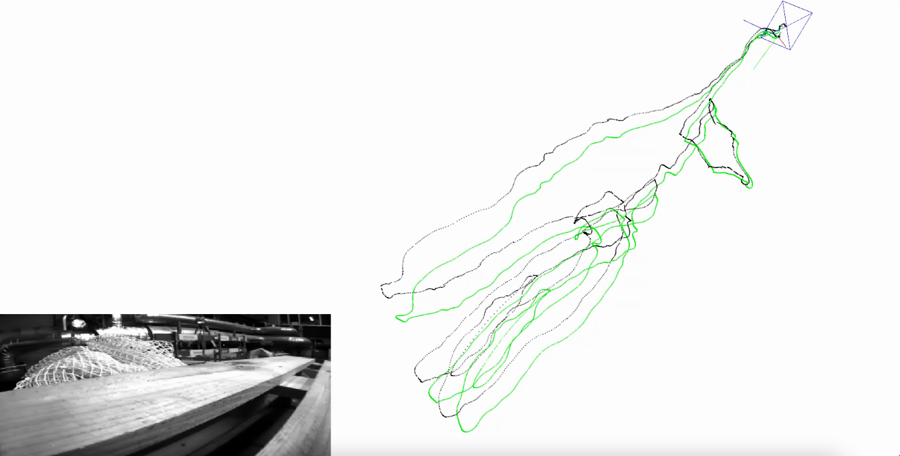

# About 

- this repo implements the stereo version of OrcVIO [project website](https://moshan.cf/orcvio_githubpage/), [Journal version](https://arxiv.org/pdf/2007.15107.pdf)

If you find this repo useful, kindly cite our publications 

```
@article{orcvio,
  title={OrcVIO: Object residual constrained Visual-Inertial Odometry},
  author={M. {Shan} and V. {Dhiman} and Q. {Feng} and J. {Li} and N. {Atanasov}},
  url = {http://erl.ucsd.edu/pages/orcvio.html},
  pdf = {https://arxiv.org/abs/2007.15107},
  journal={IEEE Transactions on Robotics},
  volume={},
  number={},
  pages={},
  year={2021},
  publisher={IEEE}
}    
```

# Requerements

* Python 3.6+
* numpy
* scipy
* cv2
* [pangolin](https://github.com/uoip/pangolin) (optional, for trajectory/poses visualization)
* [sophuspy](https://pypi.org/project/sophuspy/), check [this](https://github.com/pybind/pybind11/issues/1628#issuecomment-697346676) for how to install 

# How to run  

- change the dataset path in vio.py and run `python vio.py`  
- to speed up, use `load_features_flag` to load saved features 

# Results

- [demo video for MH_01_easy](https://youtu.be/eNaVp7B5ecQ)  


# References 

- https://github.com/uoip/stereo_msckf
